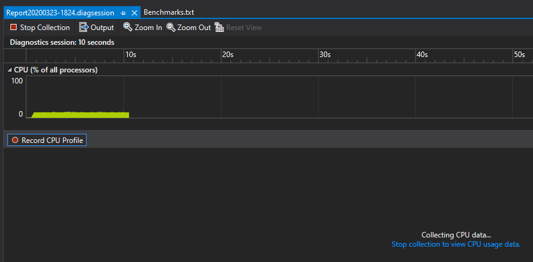

# **Optimizing Shared Data**

## **Introduction**

While the first rule of optimization is “don’t”, once you’ve made your code as clear as it can be, wrote all your unit tests and verify the actual product works, you’re still sometimes left with underwhelming performances.

When you see it being slow, once you’ve measured it, after you’ve nailed which part is the problem, you still have to come up with a solution. In this article I’ll explain a case where I saw, I measured and I located a problem. I then fixed the problem and now I’ll explain how I went about doing it.

A first caveat. I won’t be presenting the kind of amazing, low-level, well-researched, mathematically proven technique of the like of Daniel Lemire. Foe an example of that see for example:

<https://lemire.me/blog/2018/05/03/how-fast-can-you-parse-json/>

Here, we won’t be counting CPU cycles. In this article I’m simply talking about the simple optimizations an average software programmer can do day-to-day.

## **Seeing the Problem**

The program I was working on was a filter for large text files organized as a tree. That is, the indentation of each line in the file was representing the nesting level. When I say large files, I mean to routinely process 100MB to 1GB of log data. This program was written in C++.

The first simple approach was to read the text into a vector of wstring (std::vector<std::wstring>). The reason to choose this starting point is based on well-known principles on how to choose a container in C++. The first principle is:

***Always use a std::vector***

(The second principle is “use a sorted vector” and the third is “are you really sure a vector won’t do?”)

Now it was obvious when testing with large file that both reading and filtering such a large vector of strings was slow. When your stopwatch is sufficient to know the performance is not there, you’re allowed to start to take a peek.

## **Measuring the Problem**
Fortunately, taking a peek is real easy in Visual Studio. Even the community edition comes with a very decent CPU profiler. Right under the “Debug” menu, the entry “Performance Profiler...” (short-cut: Alt+F2) will open a window with your default project target already selected for profiling. From there, just click the “Start” button and your program will run under the CPU profiler. Simply do the operation your want to measure and quit. Measurement done!

Here is what the profiler window looks like while it is recording your program activities:



## **Locating the Problem**

The profiler will analyze the data and present you with a list of locations where your program is spending the most time. By default, this list is organized by total CPU time, like this:


While this gives you a view from the top, it also means you see a lot of irrelevant data. You can still find the problem area easily by looking for big jumps in the percent of time spent. It turns out a lot of time is spent copying text strings and allocating memory. The memory allocations come from the text strings and from resizing the vector they are kept it. There is also a significant amount of time spent in file I/O when reading the text. We now have a few locations, so we’re good to figure out how to solve the performance problem.

## **Borrowing a Few Tricks**

A good idea when optimizing is knowing tricks other have used. One obvious realization is that when filtering, the text itself doesn’t change. Only what is kept or not changes. That means we can borrow a few tricks from functional languages:

***Constants can be shared***

***Avoid moving data***

***Delegate managing memory***

So the idea is to make the text be shareable, to be taken from disk as directly as possible and taking away the management of the memory it resides in. So, we will be doing the following:

1. ***Constants can be shared:*** read the data from disk in large buffers of non-modifiable data.
1. ***Avoid moving data:*** scan these buffers for text lines and keep pointers directly into the buffer.
1. ***Avoid moving data:*** share these buffers and text lines in the result of filtering.
1. ***Delegate managing memory***: share these buffers when making copies of the text.

So in short we’ve gone from the code on the left to the code on the right:

```C++
struct VectorOfWStringTextHolder
{
    using Line = std::wstring;
    std::vector<Line> Lines;
};

struct VectorOfSharedBuffersTextHolder
{
    using Buffer = vector<wchar_t>;
    using BufferPtr = shared_ptr<Buffer>;
    using Buffers = vector<BufferPtr>;
    Buffers TextBuffers;

    using Line = wchar_t *;
    std::vector<Line> Lines;
};
```

 

The idea here is that by using a vector of shared buffers, the addresses of the buffers never change and can be easily be shared between multiple instances.

Of course, these changes have made the code more complex. The complexity can be hidden from view though, as the buffers can be kept private and only a vector of lines exposed publicly. The code was simplified here to make sure the benchmarks measured what we wanted to measure.

## **The Results**

Yes, benchmarks! After all, there is no point in optimizing if you cannot verify the improvement. Usually, you would simply reuse the CPU profiler and see the new results. But for this article I went further and extracted the gist of the old and new code and wrote a small benchmark program that loads a large file and make partial copies of the text lines to mimic the filtering.

The advantage of writing an explicit benchmarks is that you can put the timing measurements exactly where you want them. That way you are measuring only what is intended. With CPU profiling, the whole program is measured and it is harder to extract the relevant data.

Here are the results. (I excluded the I/O times, but reading in large buffers and parsing the buffers directly gave a similar gain.)

|**Data Format**|**Time**|
| :-: | :-: |
|Vector of strings|13.28s|
|Shared buffers of shared lines|1.2s|

As we can see, we got a more than 10x improvement in speed. (In fact, we got even more improvement on larger files as re-allocating a very large vector is very expensive.)

## **The Code**

I provided the code showing various benchmarks and another approach using std::deque. I had also done some benchmarks in a tree structure that I haven’t talked about here. (The change did not improve performance in that case, but it avoided another unrelated problem having to do with recursion depth and stack overflow when destroying deeply linked structures of shared pointers.)

You can find the code on github at this address:

<https://github.com/pierrebai/FastTextContainer>

Note that the real use case for this was in my text tree filtering project, also available on github. The optimization in done in the TextTree and how it holds the text data through a TextHolder. It also uses a similar trick to be able to have stable addresses for its tree nodes by using the often-overlooked fact that a std::deque does not invalidate pointers when appended-to. The code is at the following address:

<https://github.com/pierrebai/TreeReader>


